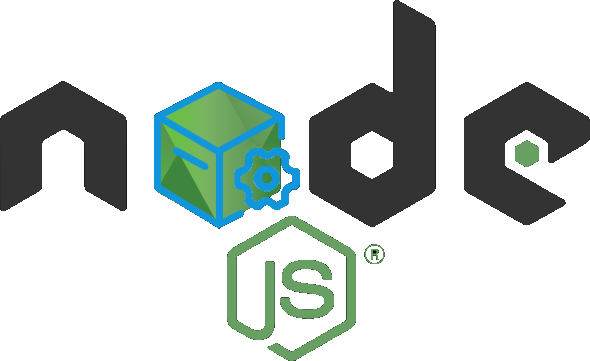

<p align="center">
    
</p>
<br>

<h1 align="center">NodeJs Utils</h1>

1. [The Problem](#problem)
2. [The Solution](#solution)
3. [Getting Started](#getting_started)
   1. [Installation](#installation)
   2. [Variables](#variables)
4. [Usage](#usage)
   1. [Express](#express)
   2. [NestJs](#nestjs)
5. [Resume](#resume)

<hr>

### The Problem 📋<a name="problem" ></a>

In the cases that we want to use the google functionality, we need to use a configuration file in JSON format but this is an unsecured method to expose our google credentials into our project

<br>
<br>

### The Solution 💡<a name="solution" ></a>

So, instead of using this file, this configuration could be saved into an environment variable, and `nodejs-utils` is the charge to search this variable and validate if first the variable was set correctly, second: validate if the content of the variable was a valid and third convert to a valid JSON type from a string. Also, this library was created with another purpose, to use for setting the logging for the current app using Pino with Pino-http so if you using an [ExpressJs][expressjs] or a [NestJs][nestjs] project this configure the logger for the corresponding type of project.

<br>
<br>

## Getting Started 🏁<a name="getting_started" ></a>

### Installation ⚙️<a name="installation" ></a>

This module is distributed via [npm][npm] which is bundled with [node][node] and
should be installed as one of your project's `Dependencies`:

```
npm install --save nodejs-utils
```

or

for installation via [yarn][yarn]

```
yarn add nodejs-utils
```

### Variables 📫<a name="variables" ></a>

You need to set into your project these environment variables:

Required

- NODE_ENV

Required only in production stage

- GOOGLE_APPLICATION_CREDENTIALS
- LOGGER_NAME

**Note:** The _NODE_ENV_ variable is in the case that you are on the development you need to put `development` and on production should be `production` this is because in development stage we don't need to logger on Google cloud and in the case that you are on `development` the other variables `GOOGLE_APPLICATION_CREDENTIALS` and `LOGGER_NAME` it will be only required on production stage.

<br>
<br>

## Usage 🛠<a name="usage" ></a>

You must need to install pino pino-pretty and pino-stackdriver

```
yarn add pino pino-pretty pino-stackdriver
```

or

```
npm install --save pino pino-pretty pino-stackdriver
```

### Express<a name="express" ></a>

Into your logger file or wherever that you configure into your project, you must only import ExpressLogger and declare to use the logger:

```
import { ExpressLogger } from 'nodejs-utils'

const logger = ExpressLogger()

logger.info('...')

```

### NestJs<a name="nestjs" ></a>

In the case that you project is on [NestJs][nestjs] you need to install the above library:

```
yarn add pino nestjs-pino
```

or

```
npm install --save pino nestjs-pino
```

Into your `app.module.ts` file you should set this configuration:

```
import { LoggerModule } from 'nestjs-pino'
import { NestJsLogger } from 'nodejs-utils'

@Module({
  imports: [
    LoggerModule.forRoot(NestJsLogger()),
    ...
  ],
  controllers: [],
  providers: [],
})
```

Also into `main.ts`:

```
import { Logger } from 'nestjs-pino'

async function bootstrap() {
  ...
  app.useLogger(app.get(Logger))
  ...
}

```

<br>
<br>

## Resume 🧾<a name="resume" ></a>

That's all now you can start to use this library. Happy Coding 👩‍💻👨‍💻🧑‍💻

[npm]: https://www.npmjs.com/
[yarn]: https://classic.yarnpkg.com
[node]: https://nodejs.org
[expressjs]: https://expressjs.com/
[nestjs]: https://nestjs.com/
